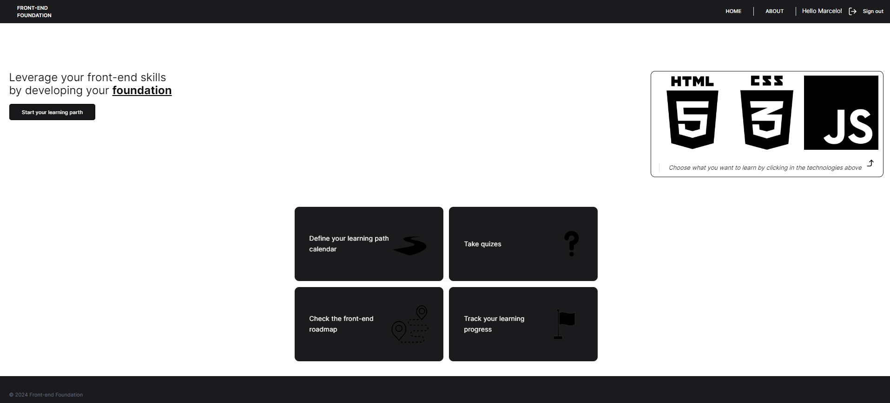
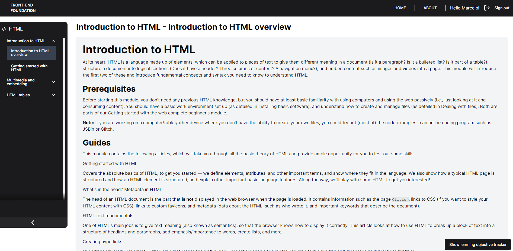
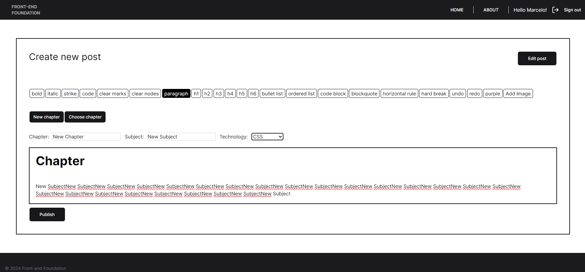
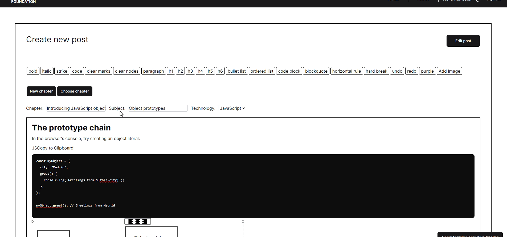
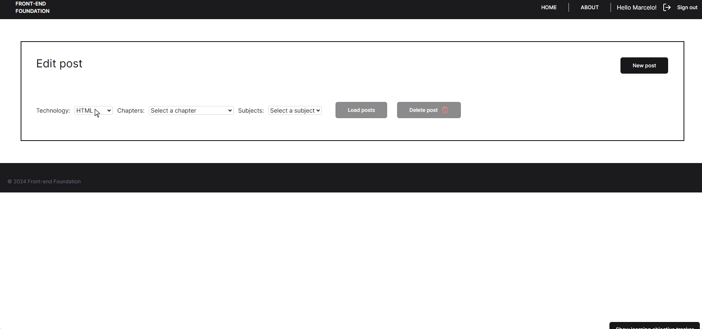

<h1 align="center">
    Front-End-Foundation
</h1>

<h3 align="center">
  A full stack CMS web platform focused on teaching the foundation of front-end development
</h3>

  <a href="#rocket-technologies">Technologies</a> &nbsp; | &nbsp;  <a href="https://front-end-foundation.vercel.app/" target="_blank">Website</a>

> [!NOTE]
> Under construction

## :sparkles: Features

- [x] Learning pages:
  - [x] HTML
  - [x] CSS
  - [x] JavaScript
- [x] Admin page:
  - [x] Abble to add a post
  - [x] Abble to edit a post
  - [x] Abble to delete a post
  - [x] Abble to list a post
- [x] Auth page using clerk
- [ ] Roadmap page
- [ ] Progress tracking page
- [ ] Learning path calendar page
- [ ] Quizzes page

  
  
  
  <h2 align="center">
    Fully customized CMS using Supabase to store the content: 
  </h2>
  
  

## :rocket: Technologies

- [Next.js](https://nextjs.org/)
- [Typescript](https://www.typescriptlang.org/)
- [Shadcn](https://ui.shadcn.com/)
- [Tailwind CSS](https://tailwindcss.com/)
- [Supabase](https://supabase.io/)
- [Clerk](https://clerk.dev/)

